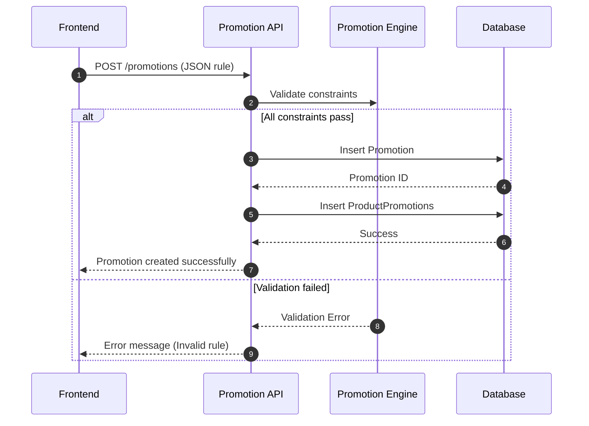
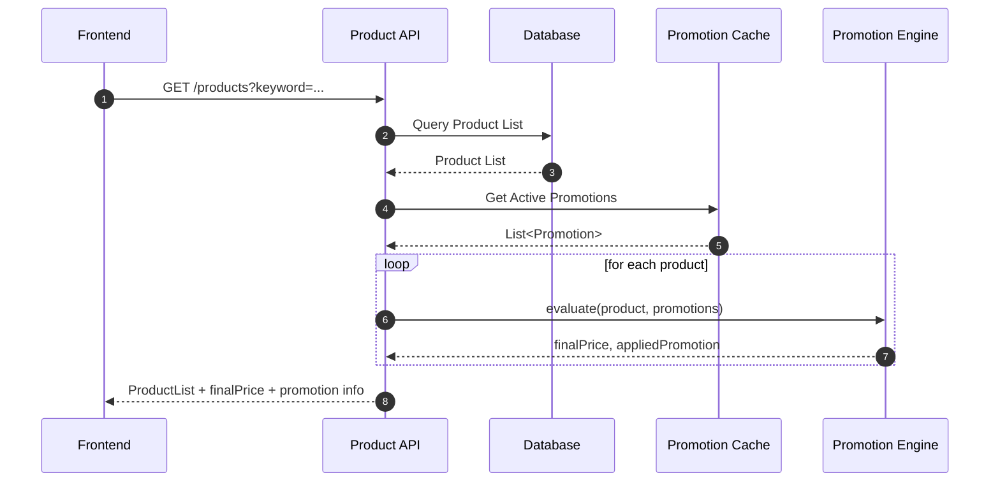
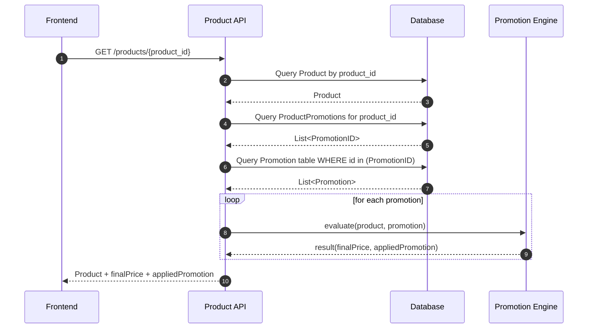
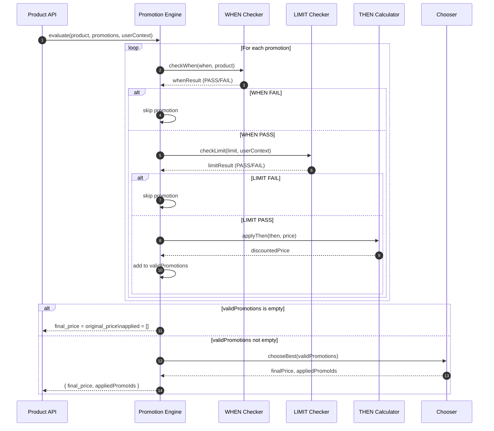

# Đặc tả hệ thống promotion

## I. Giới thiệu chung

Hệ thống Promotion chịu trách nhiệm quản lý và áp dụng các chương trình khuyến mãi lên sản phẩm. Hệ thống hướng đến khả năng mở rộng trong các quy tắc áp dụng, đặc biệt trong ecommerce thì sẽ có những quy tắc rất phức tạp. Đặc tả này mô tả bộ quy tắc trong hệ thống promotion vừa đủ trong bài tập lớn này.

Thiết kế hướng đến:

- Dễ mở rộng

- Dễ quản lý logic

- Dễ parse và evaluate

- Đảm bảo hiệu năng khi áp dụng trên nhiều sản phẩm

- Cho phép admin định nghĩa linh hoạt trên bộ rule có sẵn
- Dễ dàng kiểm tra điều kiện và áp dụng rule
- Dễ mở rộng thêm loại khuyến mãi mà không quá phụ thuộc vào `promotion_type`
- Có cấu trúc rõ ràng để thiêt kế API

## II. Tổng quan về hệ thống

### 1. Phạm vi

Module Promotion bao gồm:

- Tạo và cập nhật các chương trình khuyến mãi
- Xây dựng một engine cho hệ thống khuyến mãi, bao gồm 3 quy trình validation, application và limitation.
- Áp dụng khuyến mãi cho sản phẩm khi hiển thị
- Xử lý ưu tiên giữa nhiều chương trình khuyến mãi
- Hỗ trợ các API cần thiết để hệ thống truy và tính toán giá

Hệ thống sẽ được xây dựng tối thiểu nhất có thể cho một trang web single vendor để họ tung ra những chiến dịch khuyến mãi cho shop.

### 2. Kiến trúc tổng thể

Hệ thóng promotion sẽ bao gồm những phần chính sau:

#### a. Hệ thống rule cho promotion

Lưu trữ thông tin chương trình khuyến mãi ở dạng JSON rule set, bao gồm

- Trường `when` - Định nghĩa điều kiện áp dụng khuyến mãi
- Trường `then` - Định nghĩa khuyễn mãi sẽ được áp dụng nếu thỏa điều kiện
- Trường `limit` - Định nghĩa giới hạn khuyến mãi được sử dụng

Trong từng trường, sẽ lại được định nghĩa thêm những trường khác để tạo thành một bộ rule hoàn chỉnh, làm giảm thiểu sự phức tạp trong quá trình

Dữ liệu được lưu trong và có thể được cache để tăng hiệu năng.

#### b. Engine để xử lý logic cho promotion

Engine này sẽ là main entry cho việc parse rule, xử lý logic cùng với database để query, tính toán, xử lý logic cho mọi vấn đề liên quan đên hệ thống giảm giá.

#### c. Bộ API

Tạo một bộ API để người dùng có thể tương tác với hệ thống

### III. Nghiệp vụ chính

#### 1. Hành động CRUD cho khuyến mãi

Admin có thể tạo, xem, xóa, sửa ra chương trình khuyến mãi bằng cách khai báo rule JSON gồm 3 phần:

- `when`: điều kiện áp dụng

- `then`: hành động giảm giá

- `limit`: giới hạn

Mỗi lần tạo promo thì process để lưu vào bảng ProductPromotions, tức là promotion gắn liền với sản phẩm để sau query cho dễ.



#### 2. Hiển thị giá sản phẩm

Khi FE gọi API danh sách hoặc chi tiết sản phẩm:

- BE lấy sản phẩm

- Lấy danh sách promotion đang active

- Với mỗi promotion:

  1. Kiểm tra điều kiện `when`

  2. Kiểm tra limit

  3. Nếu hợp lệ → áp dụng then để tính giá cuối

Sơ đồ khi query list sản phẩm



Sơ đồ khi query promo cho sản phẩm nhất định



#### 3. Chọn promotion tối ưu

Hệ thống sẽ tự tính toán và chọn ra số lượng promotion tối ưu nhất cho sản phẩm. Số lượng promotion tối đa có thể áp dụng tùy vào nghiệp vụ của shop, có thể 1, có thể 2, có thê 3,. hoặc tùy theo từng sản phẩm

#### 4. Áp dụng khuyến mãi trong giỏ hàng

Trong bước Checkout, hệ thống đánh giá các rule liên quan đến:

- Tổng giá trị đơn hàng

- Số lượng từng sản phẩm

- Combo “mua X tặng Y” nếu có rule :))

- Giảm theo phần trăm hoặc số tiền

Kết quả trả về:

- Tổng tiền trước giảm

- Tổng giảm giá

- Tổng thanh toán

Giỏ hàng không cần biết danh sách promotion nào đang được áp dụng.

### IV. Chi tiết hệ thống

#### 1. **Bộ ruleset**

Bộ rule sẽ dùng định dạng `json` để định nghĩa, trong đó mục sau sẽ mô tả nhũng trường cần có trong bộ ruleset.
| Trường | Bắt buộc | Mô tả | Vai trò |
| --------- | -------- | --------------------------- | ---------------------------------------- |
| **when** | ✔ | Điều kiện áp dụng promotion | Quyết định promotion có hợp lệ hay không |
| **then** | ✔ | Hành động khuyến mãi | Tính toán giảm giá |
| **limit** | ✔ | Giới hạn áp dụng | Kiểm soát số lần & tính chất áp dụng |

- Bảng mô tả chi tiết - Trường `when`

| Trường           | Kiểu dữ liệu | Bắt buộc | Mô tả nghiệp vụ                                                                                                     | Điều kiện áp dụng (Logic)                                                                     | Ví dụ                                                                  |
| ---------------- | ------------ | -------- | ------------------------------------------------------------------------------------------------------------------- | --------------------------------------------------------------------------------------------- | ---------------------------------------------------------------------- |
| **times**        | ["object"]   | ✖        | Danh sách khoảng thời gian mà promotion có hiệu lực. Nếu không khai báo thì promotion luôn hợp lệ về mặt thời gian. | Promotion hợp lệ nếu như start < end , thời gian tối thiểu là 10p và là bội số của 5p         | `[{ "start": "2025-12-01T00:00:00Z", "end": "2025-12-05T23:59:59Z" }]` |
| **products**     | ["string"]   | ✖        | Danh sách ID sản phẩm mà promotion áp dụng. Nếu không có trường này → promotion áp dụng cho **tất cả sản phẩm**.    | Nếu khai báo: `product.id ∈ products` → PASS. Nếu không khai báo → luôn PASS với mọi product. | `["uuid-sample1", "uuid-sample2", "uuid-sample3"]`                     |
| **categories**   | ["string"]   | ✖        | Danh sách category code hoặc category ID áp dụng promotion. Nếu không có → promotion áp dụng cho mọi category.      | Nếu khai báo: `product.category ∈ categories` → PASS. Nếu không có → luôn PASS.               | `["SHOES", "SPORT"]` hoặc `[23, 47]`                                   |
| **min_price**    | number       | ✖        | Điều kiện về giá tối thiểu để áp dụng promotion. Nếu không có → hệ thống coi như **không yêu cầu giá**.             | `product.price >= min_price` → PASS. Nếu không khai báo → PASS với mọi category.              | `200000`                                                               |
| **min_quantity** | number       | ✖        | Điều kiện về số lượng tối thiểu trong giỏ hàng để áp dụng promotion. Nếu không có → luôn PASS.                      | `cartItem.quantity >= min_quantity` → PASS. Nếu không khai báo → PASS.                        | `2`                                                                    |

- Bảng mô tả chi tiết - Trường `then`

| Trường    | Kiểu dữ liệu  | Bắt buộc | Áp dụng cho loại type | Mô tả nghiệp vụ                                          | Ví dụ                                |
| --------- | ------------- | -------- | --------------------- | -------------------------------------------------------- | ------------------------------------ |
| **type**  | string (enum) | ✔        | Tất cả                | Loại hình khuyến mãi. Quy định cách tính giá cuối.       | `"PERCENT"`, `"FIX"`, `"FLASH_SALE"` |
| **value** | number        | ✔        | Tất cả                | Giá trị chiết khấu: phần trăm, số tiền hoặc giá cố định. | `20`, `30000`, `99000`               |

- Bảng mô tả chi tiết - Trường `limit`

| Trường        | Kiểu dữ liệu | Bắt buộc | Mô tả nghiệp vụ                                                                               | Điều kiện áp dụng                                                  | Ví dụ   |
| ------------- | ------------ | -------- | --------------------------------------------------------------------------------------------- | ------------------------------------------------------------------ | ------- |
| **per_user**  | number       | ✖        | Số lần tối đa mỗi user được sử dụng promotion. Nếu không khai báo → không giới hạn theo user. | Nếu `usage_by_user ≥ per_user` → không được áp dụng.               | `2`     |
| **total**     | number       | ✖        | Tổng số lượt áp dụng cho toàn hệ thống. Nếu vượt → promotion tự động vô hiệu hóa.             | Nếu `usage_total ≥ total` → reject.                                | `1000`  |
| **stackable** | boolean      | ✔        | Quy định promotion có thể cộng dồn với promotion khác hay không.                              | `true` → được cộng chung; `false` → chỉ chọn 1 promotion tốt nhất. | `false` |

#### 2. Engine promotion

Promotion Engine là thành phần chịu trách nhiệm đánh giá bộ ruleset khuyến mãi và tính toán giá sau giảm cho từng sản phẩm. Engine hoạt động theo pipeline:

```
WHEN → LIMIT → THEN → CHOOSE THE BEST → FINAL PRICE
```

Engine được thiết kế để:

- Xử lý nhiều promotion trên một sản phẩm

- Đảm bảo đúng điều kiện (WHEN)

- Tôn trọng giới hạn sử dụng (LIMIT)

- Xác định áp dụng khuyến mãi ntn (THEN)

- Chọn khuyến mãi tốt nhất

- Tính toán final price



Thứ tự ưu tiên của promotion, bộ Chooser sẽ dựa theo thứ tự này, kết hợp với trường `stackble` để xác định những promo nào tốt nhất cho sản phẩm

```
FLASH_SALE > PERCENT > FIX
```

#### 3. Bộ API (để sau)
